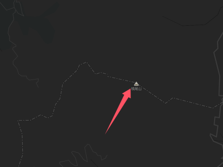
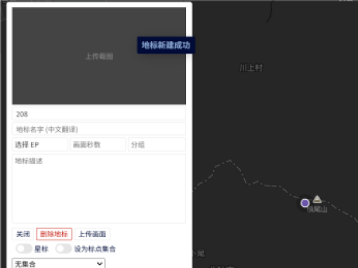
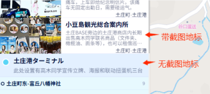
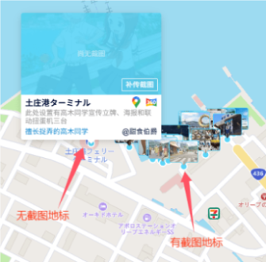
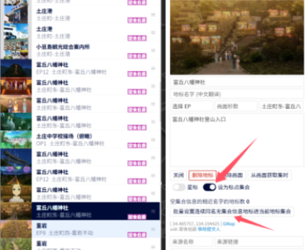
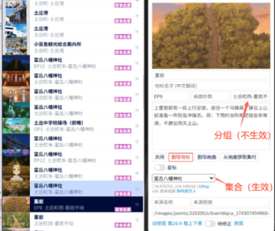
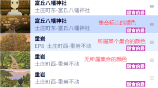
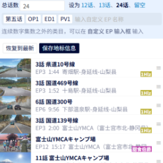
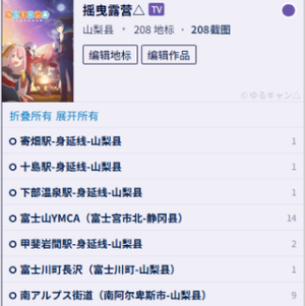

# Anitabi地标编辑器 快速使用指南

本指南记录了通过地标编辑器批量编辑 [Anitabi](https://anitabi.cn/map) 地标的一些方法与 Tips，为拥有编辑权限的管理员用户提供一些快速参考。

## 基础编辑办法

### 新增地标

（管理员可以在地图上任何一个没有地标的空位上创建空地标）

首先在地图上找到希望新增标点的位置，然后单击该位置，即可在该位置上生成一个默认地标。

地标如果位于已标记地理信息的位置上，则自动以该地理位置命名（在这个例子中，如果你在横尾山的位置新建地标，就会自动命名为横尾山）。
否则，将按照地标顺序命名（例如，第208个地标会命名为208）。

（成功创建地标）

在某些缩放等级下不允许新建地标，这种情况下需要放大地图的缩放比例。

编辑器右上角的搜索框也可以用于新建地标。

**【重要Tips】** 由于新建坐标是通过鼠标单击完成的，因此非常容易在拖拽地图时误触导致创建了新的空坐标。因此，需要留意编辑器的提示，最好在每次保存前检查地标列表底部是否有多余的空地标。

### 编辑地标信息

（地标各可编辑元素的说明）

一个地标必要的三要素是对应动画截图、日文地标名与分组名。

1. 分组名为空的情况下，默认归类到以作品名命名的分组。如果没有这个分组，则会自动创建一个。  
2. 地标名为空的情况下，默认根据地标序号生成一个地标名。例如，在本示例中，地标名以208命名。  
3. 截图为空的情况下，则此地标为无截图地标。无截图地标和有截图地标在用户界面的展示区别参考下方所示，无截图地标不会在地图和地标列表上显示缩略图。
4. 画面优先使用无水印、无字幕、原比例、高度1080px或720px的截图。  
5. 编辑器界面画面使用16:9展示，有灰边说明比例不是16:9。前台画面会通过16:9裁剪中间区域进行展示。  
6. 画面上传支持浏览器支持的全部图片格式，所有画面上传之前会按照JPEG 90%质量进行压缩。

（示例：无截图地标与有截图地标）

其它非必填元素包括：中文地标名、对应EP及秒数、地标描述信息、标点集合。

1. 前端显示时，中文地标名的优先级大于日文地标名。  
2. 画面秒数 = 60 * 分钟 + 秒，可自行推算。
3. 地标描述信息通常为：地标景点简介、旅行Tips、敬告、不法闯入警告等，原则上需要具备实用性，可引用官方指南信息等可靠信源。  
4. 标点集合的优先级高于分组名，会自动将所有地标名相似的地标归纳到以该地标命名的分组中，且此分组的中心为该地标。

### 地标集合/分组的优先级关系及错误排查办法

如果遇到个别分组不生效的情况，请检查该地标是否属于某个集合中。 被加入到集合的地标会以深色形式出现在标点列表中。以下方的情况为例：

在这个例子中，富丘八幡神社的最后一个地标被设为了集合地标。该地标及其他被设置为该集合的地标都会单独归属于一个以集合地标命名的分组，而不是它被设置的分组“土庄町东-富丘八幡神社”。

紧接着，重岩的第一个地标被设置到前一个地标的集合“富丘八幡神社”中。因此，它不会被分组到所分组名元素中设置的“土庄町西-重岩不动”。

在用户界面，这两个地标会被单独分类到一个以“富丘八幡神社”命名的分组。

在地标列表中，地标会根据集合状态显示不同的颜色，具体的状态-颜色关系参考下图示例：

**【重要Tips】** 遇到个别地标所设置的分组名不生效的情况，请优先检查该地标是否属于某个集合，确认无误后再上报问题。

### 分组排序规则

（示例：对地标手动排序后，编辑器界面的分组展示）

用户在前端看见的分组排序，由该分组名在编辑器中出现的顺序决定。例如，对于上方示例图中的地标排序：

- 首个出现的分组名是【寄畑駅-身延线-山梨县】  
- 第二个出现的分组名是【十島駅-身延线-山梨县】  
- 第三个出现的分组名是【下部温泉駅-身延线-山梨县】  

以此类推...

最终呈现在用户面前的分组排序如图所示。

（示例：用户界面的分组展示排序）

目前编辑器只支持对单个地标进行拖拽排序，因此，如果需要对用户界面的分组进行排序，可以考虑以下两种方法：

1. （可读性好，操作量大）手动将每个分组的所有地标挪到想要的分组排序位置。
2. （可读性差，操作量少）将每个分组的第一个地标放在地标列表的顶部，再根据想要的排序对这些地标单独排序。

**可维护性/可读性的约定规范**

为了方便其他编辑者的改动，在新增/编辑地标时，务必参考以下规则：

1. 将归属于同一分组的地标放在列表中连续的位置。  
2. 对于新增分组的地标组，尽量放在地理位置与之接近的分组前后。  
3. 对于相邻地标，尽量使用相同或相似的地标名。对于需要高辨识度地标信息的情况，可以例外。例如：对于善光寺周围的民居，可以用【善光寺西侧】、【善光寺东侧】等方式命名。但地标如果位于名为大川商店的商业设施前，为了改善用户实地使用时的易用性，可以考虑命名为【大川商店前】或者【善光寺北侧-大川商店前】。  
4. 进行大修时，请在该词条的编辑器中将词条状态标记为【刚开工】、【基础搭建】、【初步完工】或【基本完工】。在完成大修后更改为【完工】状态。  
5. 对于新增分组名，尽量沿用原有的命名风格。为了改善用户实地使用时的易用性，可以考虑以【区域名】-【最近的公交站点】-【行政区划】的方式命名。
6. 进行大修时，尽量在编辑器底部的输入栏中记录本次大修的内容与日期。

(示例：大修备注)

### 保存地标信息

建议养成频繁保存的习惯，主要由于：

1. 如果有两个用户对同一词条进行编辑，先提交的改动会被覆盖。  
2. 地标编辑器的页面在传图时偶尔会出现崩溃、卡死的情况。该情况下快捷键不生效。

### 快捷导入/快速编辑/快速清空办法

编辑器支持通过 KM[LZ] 地标或谷歌地图的地标链接实现快捷导入，具体参考官方文档[从 KML 导入地标](https://github.com/anitabi/anitabi.cn-document/blob/main/tutorial-basics/import-from-kml.md)和[从Google Map导入](https://github.com/anitabi/anitabi.cn-document/blob/main/tutorial-basics/jump-from-google-map.md)。

例如，当你导入某个圣地巡礼博客的地图时，会自动生成多个地标，且每个地标的提交人默认为第三方来源。

（慎用）编辑器支持一键清空所有有图/无图地标或分组，也支持一键删除所有地标的简介。另外，也支持一键整理所有地标的标题。

（慎用）编辑器支持一键变更所有地标的提交人。

### 杂项

1. 在安装同步浏览谷歌地图用户脚本后，可以通过谷歌地图同步浏览编辑器中地标的位置。  
2. 编辑器不支持手机端。  
3. 除特殊提示之外的操作默认不保存不生效，有问题可以点击【恢复到最新】重新开始编辑。
4. 管理器支持通过 DotPlayer 的截图命名格式自动抓取话树和时间，这将在上传截图后自动覆盖地标原先的话数/秒数信息，请注意。
